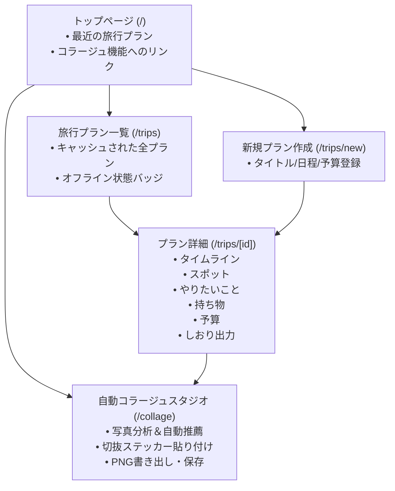

# 🗺️ Marcaderno（マルカデルノ）

> **「旅のしおりをポケットに。電波のない飛行機や海外でも安心して使える、温かみのある旅行プランナー」**

Marcaderno（マルカデルノ）は、温かみのある手帳・スクラップブック調のデザインで旅の計画から思い出作りまでをサポートする、モバイルファーストの旅行プランニングWebアプリケーションです。

---

## 🌟 主な機能

### 1. ✈️ 旅行プラン管理（Trips）
- **プラン作成・一覧**: 旅行タイトル、目的地、旅行日程（出発日〜帰着日）、総予算、カバー画像を設定。
- **安心の自動保存**: 作成したプランはサーバー同期と同時にブラウザ内（IndexedDB）へキャッシュ。

### 2. ⏱️ 旅程タイムライン（Timeline / Schedules）
- **日別時系列スケジュール**: 日程ごとの行動予定を縦型タイムラインで直感的に表示。
- **移動手段・所要時間**: 徒歩・電車/新幹線・バス・車/レンタカー・飛行機・船・タクシーの各移動種別、便名、所要時間、移動費用の記録。
- **ホテル連泊チェックイン・チェックアウト**: 宿泊期間や朝食有無を一元管理。
- **完了チェック**: 訪れた場所や終えたスケジュールにチェックを入れ、旅の進捗を可視化。

### 3. 📍 行きたい場所・スポット管理（Places）
- **カテゴリ別分類**: 🍽️ ご飯・グルメ / 🏛️ 観光スポット / ☕ カフェ・甘味 / 🏨 宿泊・ホテル / 🛍️ ショッピング / 🎟️ アクティビティ / 🔖 その他。
- **詳細情報の一元化**: 住所、Google Mapsリンク、公式サイトURL、営業時間、目安予算、メモ、お気に入り度（星評価）。
- **予約ステータス**: 「未予約」「要予約」「予約済み」で手配漏れを防止。
- **タイムライン連携**: 登録スポットをそのまま特定日時の旅程に組み込み可能。

### 4. ✨ 旅のやりたいことリスト（Wish Collection）
- **アイデアストック**: 「このカフェのプリンを食べる」「夕暮れの海辺を散歩する」などのWishを気軽に保存。
- **ステータス管理**: アイデア（IDEA）→ 候補（CANDIDATE）→ 達成（DONE）→ ベスト体験（BEST）。
- **インスピレーション提案**: 旅のアイデアを刺激するカテゴリ別プロンプト集からワンクリック追加。

### 5. 🎒 持ち物チェックリスト（Packing Manager）
- **カテゴリ別チェック**: 必需品・衣服・電子機器・薬/コスメ・その他。
- **残数カウント＆進捗バー**: 未パッキングの個数をひと目で把握。定番アイテムのプリセット機能付き。

### 6. 💰 予算＆費用サマリー（Budget Summary）
- **自動集計＆プログレスバー**: 設定した総予算と実際の支出（交通費・宿泊費・飲食費等）をリアルタイム集計。使いすぎを防止。

### 7. 📖 旅のしおり書き出し（Offline HTML/PDF Bookmark）
- **スタンドアロンしおり出力**: 全旅程・ホテル・スポット・持ち物・緊急連絡先を美しくまとめたHTML/PDF形式のしおりを生成。
- 印刷やLINEでの旅仲間への共有に対応。

### 8. 📴 完全オフライン動作（PWA & IndexedDB）
- **通信量ゼロ・電波なし対応**: 飛行機内や海外ローミングOFF時でも、保存された旅程やスポットをIndexedDBから瞬時に読み込み・閲覧可能。

### 9. 📸 自動旅行コラージュ（Collage Studio）
- **100% 端末内生成（プライバシー完全保護）**: 外部サーバーや生成AI APIへの写真アップロードを行わず、ブラウザ内（Canvas API）で1秒以内に高速合成。
- **写真特徴の自動分析**: 写真の縦横比、縦写真・横写真・正方形、明るさを自動判定。
- **テンプレート自動推薦＆スコアリング**: 写真構成に最も合うテンプレート（スクラップブック調、ポラロイド風、マガジン風、シネマ風等）を10〜99点で自動提案。
- **自然な傾き（Controlled Jitter）**: 美しいグリッド骨格を維持しながら、手作りのような自然な揺らぎ（±2〜4度）を付与。
- **✂️ iPhone被写体長押しコピペ（切り抜きステッカー）対応**:
  - iPhoneの写真アプリで人物や物を長押し「コピー」→「ワンタップで貼る」で即座にコラージュに追加。
  - 背景透過PNGを自動認識し、四角い白枠を付けず**自然な影（ドロップシャドウ）付きのステッカーとして最前面に配置**。
  - 通常写真のレイアウトを崩さず、四隅や余白にバランスよく自動配置。
- **画像書き出し**: 高解像度PNG保存（iOSの写真アプリ保存に対応）、アプリ内への保存（後から再編集・閲覧可能）。

---

## 📱 画面・ルート構成（サイトマップ）



---

## 🛠️ 技術スタック

- **フロントエンド / フレームワーク**: [Next.js](https://nextjs.org/) (App Router), [React 19](https://react.dev/), [TypeScript](https://www.typescriptlang.org/)
- **スタイリング**: [Tailwind CSS v4](https://tailwindcss.com/)
- **データベース & ORM**: [Prisma](https://www.prisma.io/), [PostgreSQL (Neon)](https://neon.tech/) / SQLite
- **オフライン・PWA**: Service Worker, Cache API, [IndexedDB](https://developer.mozilla.org/ja/docs/Web/API/IndexedDB_API)
- **画像合成・グラフィックス**: HTML5 Canvas API
- **アイコン**: [lucide-react](https://lucide.dev/)

---

## 🚀 開発環境のセットアップ

```bash
# リポジトリのクローン
git clone https://github.com/aykogt08/travel-planner.git
cd travel-planner

# 依存パッケージのインストール
pnpm install # または npm install

# データベースのセットアップ
pnpm prisma generate
pnpm prisma db push

# 開発サーバーの起動
pnpm dev # または npm run dev
```

ブラウザで [http://localhost:3000](http://localhost:3000) を開いてご利用ください。
